<picture>
  <source media="(prefers-color-scheme: dark)" srcset="assets/banner.svg">
  <source media="(prefers-color-scheme: light)" srcset="assets/banner-light.svg">
  
</picture>

Construo aplicações web do banco de dados à interface.
Engenharia da Computação · Universidade Federal do Ceará

## Projetos

### [Liquid Journal](https://liquid-journal-trading-app.vercel.app) · diário de trading

Um SaaS onde traders registram suas operações e enxergam o próprio desempenho.
Contas em BRL, USD e EUR com cotação ao vivo, calculadora de resultado com câmbio
embutido, curva de patrimônio e calendário de ganhos e perdas.

Next.js · TypeScript · Supabase · PostgreSQL · Tailwind

[**Abrir o app →**](https://liquid-journal-trading-app.vercel.app) · produto comercial, código fechado

### [CineSol](https://cinesol-cinema.vercel.app) · reserva de cinema

Escolha de assento, montagem de combo e fluxo de compra até a confirmação.

Next.js · TypeScript · Tailwind

[**Ver demo →**](https://cinesol-cinema.vercel.app) · [código](https://github.com/joaotabosa3599/cinesol-cinema)

### [Anabijus](https://anabijus-ecommerce.vercel.app) · e-commerce de joias

Loja com autenticação, carrinho persistente e painel do cliente.

React · Vite · JavaScript

[**Ver demo →**](https://anabijus-ecommerce.vercel.app) · [código](https://github.com/joaotabosa3599/anabijus-ecommerce)

### [Portfólio](https://portfolio-orcin-nine-x51rqo3inw.vercel.app) · site pessoal

Meus projetos em detalhe, com estudo de caso e histórico de experiência.

React · TypeScript · Tailwind · Framer Motion

[**Ver site →**](https://portfolio-orcin-nine-x51rqo3inw.vercel.app) · [código](https://github.com/joaotabosa3599/portfolio)

## Stack

<table>
<tr>
<td valign="top" width="50%">

**Interface**

</td>
<td valign="top" width="50%">

**Servidor e dados**

</td>
</tr>
<tr>
<td valign="top">

**Mobile**

</td>
<td valign="top">

**Testes e deploy**

</td>
</tr>
</table>

Na faculdade também trabalho com Java e C — estruturas de dados e processamento de texto
estão nos repositórios públicos.

## Estudando agora

Arquitetura de API REST, modelagem relacional e Row Level Security no Postgres.
Quero desenhar de onde o dado vem, não só consumi-lo.

