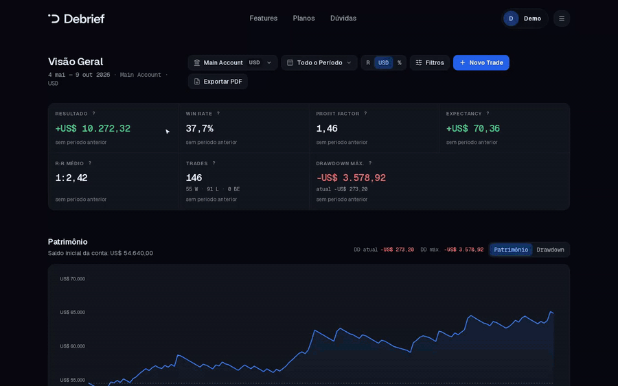
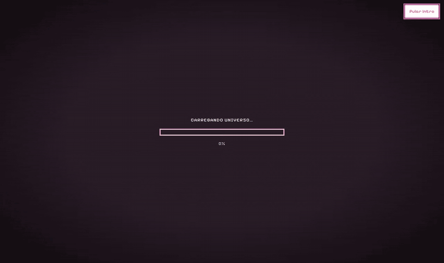
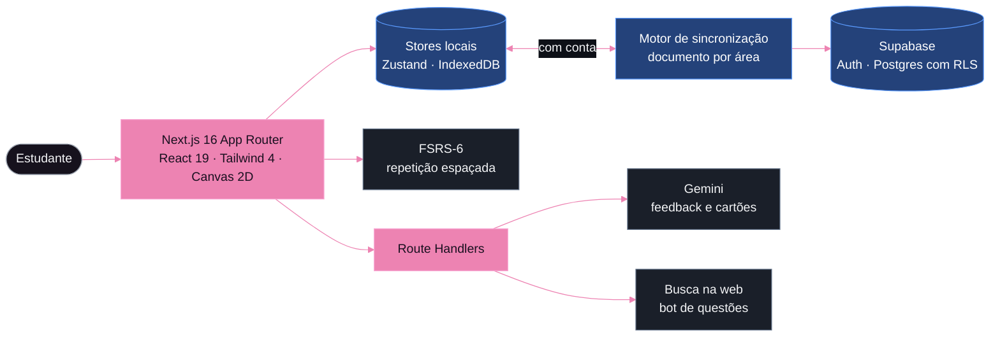

<a href="https://portfolio-orcin-nine-x51rqo3inw.vercel.app">
<picture>
  <source media="(prefers-color-scheme: dark)" srcset="assets/banner.svg">
  <source media="(prefers-color-scheme: light)" srcset="assets/banner-light.svg">
  
</picture>
</a>

 

   

 

## Projetos

 &nbsp;  &nbsp; 

**Debrief** é um SaaS onde traders registram cada operação com o contexto que justificou
a entrada e descobrem, nos próprios números, o que funciona no seu operacional.
Contas em BRL, USD e EUR com cotação ao vivo, calculadora de resultado com câmbio
embutido, prints e notas em cada trade, tags por estratégia, calendário de PNL,
feedback de IA sobre o histórico, exportação em PDF e notificações push.

**Stack**

              

**Destaques técnicos**

- **Trades monitorados ao vivo:** um `pg_cron` roda a cada minuto, confere as velas
  de 1 minuto e, se o preço tocou o stop ou o alvo, fecha a operação no nível,
  calcula o resultado na moeda da conta e avisa por push.
- **Sem service role no job:** a rotina lê e grava por funções do banco travadas
  por um segredo, e o resto do app vive sob Row Level Security.
- **Cena 3D no topo da página inicial**, com React Three Fiber e o scroll
  coreografado em GSAP.
- **Português e inglês**, com rotas por idioma e troca de idioma no app.
- **Calendário econômico do TradingView** (FOMC, CPI, NFP) dentro do dashboard e
  exportação da conta em PDF e CSV.

> [!NOTE]
> Produto comercial em desenvolvimento, por isso o repositório é privado.
> O app está no ar e aberto para uso. Antes se chamava Liquid Journal.

<b>Registro de um trade, do ativo ao PNL</b> · GIF de 27s

 

Buscar o ativo · informar entrada e saída · a calculadora fecha o PNL na moeda da conta · anexar o print e as notas · salvar e ver o dashboard se atualizar

<b>Como ele é montado</b>

 

```mermaid
%%{init: {"theme": "base", "themeVariables": {
  "fontFamily": "-apple-system, Segoe UI, Helvetica, Arial, sans-serif",
  "primaryColor": "#12161e", "primaryTextColor": "#f3f4f6", "primaryBorderColor": "#273040",
  "lineColor": "#2563eb", "edgeLabelBackground": "#0d1017", "clusterBkg": "#0d1017"
}}}%%
flowchart LR
    U([Trader]) --> APP["Next.js App Router<br/>React · Tailwind · ECharts"]
    APP --> SA["Server Actions<br/>e Route Handlers"]
    SA --> AUTH["Supabase Auth<br/>e-mail e Google"]
    SA --> DB[("PostgreSQL<br/>Row Level Security")]
    SA --> ST["Supabase Storage<br/>prints dos trades"]
    SA --> FX["API de câmbio<br/>BRL, USD, EUR"]
    SA --> AI["Claude API<br/>feedback de performance"]
    SA --> PUSH["Web Push<br/>notificações"]

    classDef user fill:#12161e,stroke:#9ca3af,color:#f3f4f6
    classDef app fill:#2563eb,stroke:#60a5fa,color:#fff
    classDef data fill:#14532d,stroke:#22c55e,color:#fff
    classDef ext fill:#1a1f29,stroke:#64748b,color:#f3f4f6
    class U user
    class APP,SA app
    class DB,AUTH,ST data
    class FX,AI,PUSH ext
```

Cada trader só enxerga as próprias operações, e isso é garantido no banco
por Row Level Security — não por uma checagem na aplicação que alguém possa
esquecer de escrever.

 

 &nbsp;  &nbsp;  &nbsp; 

**Constela & Órion** é uma plataforma de estudos gamificada em pixel art. Agenda
semanal com arrastar e soltar, edital com o progresso de cada assunto, quizzes
com explicação, simulados no tempo da prova e flashcards com repetição espaçada
(FSRS). São dois universos trocáveis, cada um com mascote, paleta e céu animado
próprios, a abelhinha Constela e o Ori, o axolote. Tudo funciona sem internet e
sincroniza com a conta quando ela existe. XP e conquistas premiam a constância
sem punir o dia perdido.

**Stack**

            

**Destaques técnicos**

- **Local-first:** cada tela lê e grava no aparelho (Zustand e IndexedDB) e
  funciona offline; com conta, um motor próprio sincroniza com o Supabase em
  segundo plano, sem nunca misturar dados de contas diferentes.
- **Motor de partículas em Canvas 2D**, um por universo: pétalas, estrelas
  cadentes, vagalumes e constelações que se desenham, pausado fora da tela e
  parado com movimento reduzido.
- **Intro de jogo** em game loop, com hit-stop e efeitos sonoros sintetizados na
  hora em Web Audio, sem arquivos de áudio.
- **Temas trocados por CSS**, sem piscar na hidratação, e o mascote "repinta" o
  site a partir de onde está com a View Transitions API.
- **JavaScript enxuto:** sem bibliotecas de animação nem de gráfico, com Supabase,
  formulários e abas secundárias sob demanda (35% a 61% menos JS por tela).

> [!NOTE]
> Ainda não publicado: o app ganha domínio próprio em breve. O repositório é
> privado por ser um projeto pessoal, e o GIF abaixo é o app real, com dados de
> demonstração.

<b>Da abertura ao estudo, nos dois universos</b> · GIF de 26s

 

Intro com o toca aqui · escolher o parceiro, que prepara o app · o céu da página inicial · concluir uma sessão e ganhar XP · o Ori assume o controle e repinta tudo

<b>Como ele é montado</b>

 

```mermaid
%%{init: {"theme": "base", "themeVariables": {
  "fontFamily": "-apple-system, Segoe UI, Helvetica, Arial, sans-serif",
  "primaryColor": "#16121d", "primaryTextColor": "#f3f4f6", "primaryBorderColor": "#2b2e36",
  "lineColor": "#ed83b2", "edgeLabelBackground": "#0d1017", "clusterBkg": "#0d1017"
}}}%%
flowchart LR
    U([Estudante]) --> APP["Next.js 16 App Router<br/>React 19 · Tailwind 4 · Canvas 2D"]
    APP --> LOCAL[("Stores locais<br/>Zustand · IndexedDB")]
    LOCAL <-->|"com conta"| SYNC["Motor de sincronização<br/>documento por área"]
    SYNC --> SB[("Supabase<br/>Auth · Postgres com RLS")]
    APP --> FSRS["FSRS-6<br/>repetição espaçada"]
    APP --> RH["Route Handlers"]
    RH --> AI["Gemini<br/>feedback e cartões"]
    RH --> WEB["Busca na web<br/>bot de questões"]

    classDef user fill:#16121d,stroke:#9ca3af,color:#f3f4f6
    classDef app fill:#ed83b2,stroke:#f9a8d4,color:#1a1020
    classDef data fill:#24427a,stroke:#5b9bff,color:#fff
    classDef ext fill:#1a1f29,stroke:#64748b,color:#f3f4f6
    class U user
    class APP,RH app
    class LOCAL,SYNC,SB data
    class FSRS,AI,WEB ext
```

Local-first: cada tela lê e grava no próprio aparelho e funciona sem internet.
Com conta, a sincronização roda em segundo plano, e o Row Level Security garante
que cada pessoa só enxerga os próprios dados. Quem não tem conta nem baixa o
Supabase, e o JavaScript inicial de cada tela fica entre 210 e 275 KB.

 

<table>
<tr>
<td width="33.33%" valign="top">

  
  
  
  
  
  

<ul>
  <li>Escolha de poltronas e combos da bomboniere</li>
  <li>Checkout com cartão ou Pix e recibo por download ou e-mail</li>
  <li>Cadastro e login validados com Zod e programa de pontos</li>
  <li>Desafio em dupla do processo seletivo da Loading Jr.</li>
</ul>

  <a href="https://cinesol-cinema.vercel.app"><b>Ver demo</b></a>
  &nbsp;·&nbsp;
  <a href="https://github.com/joaotabosa3599/cinesol-cinema">código</a>

</td>
<td width="33.33%" valign="top">

  
  
  
  
  
  

<ul>
  <li>Rotas protegidas que devolvem você à página de origem após o login</li>
  <li>Carrinho persistente com total em tempo real e histórico de pedidos</li>
  <li>Busca global por nome ou categoria, layout mobile-first</li>
  <li>Catálogo em JSON trocável por uma API real sem mexer nas telas</li>
</ul>

  <a href="https://anabijus-ecommerce.vercel.app"><b>Ver demo</b></a>
  &nbsp;·&nbsp;
  <a href="https://github.com/joaotabosa3599/anabijus-ecommerce">código</a>

</td>
<td width="33.33%" valign="top">

  
  
  
  
  
  
  

<ul>
  <li>Cena 3D em CSS (sem WebGL) no topo, que se abre com o ponteiro</li>
  <li>Abertura com câmera orbitando, pulável e desligada com movimento reduzido</li>
  <li>Estudos de caso gerados a partir de dados</li>
  <li>Imagens AVIF e WebP responsivas e fontes auto-hospedadas</li>
</ul>

  <a href="https://portfolio-orcin-nine-x51rqo3inw.vercel.app"><b>Ver site</b></a>
  &nbsp;·&nbsp;
  <a href="https://github.com/joaotabosa3599/portfolio">código</a>

</td>
</tr>
</table>

 

## Stack

<table align="center">
<tr>
<td align="center" valign="top" width="25%">

**Interface**

 
 

</td>
<td align="center" valign="top" width="25%">

**Servidor e dados**

 

</td>
<td align="center" valign="top" width="25%">

**Mobile**

</td>
<td align="center" valign="top" width="25%">

**Testes e deploy**

 

</td>
</tr>
</table>

<b>Também trabalho com</b>

 

Java e C, da graduação em Engenharia da Computação. Estruturas de dados,
processamento de texto e um sistema de gestão de funcionários estão nos
repositórios públicos.

 

 

## Estudando agora

Quero desenhar de onde o dado vem, não só consumi-lo.

<table>
<tr>
<td align="center" width="33.33%">🧭 <b>Arquitetura de API REST</b></td>
<td align="center" width="33.33%">🗂️ <b>Modelagem relacional</b></td>
<td align="center" width="33.33%">🔐 <b>Row Level Security no Postgres</b></td>
</tr>
</table>

 

<picture>
  <source media="(prefers-color-scheme: dark)" srcset="https://streak-stats.demolab.com/?user=joaotabosa3599&hide_border=true&border_radius=16&background=15171C&stroke=2B2E36&ring=7F5AF5&fire=5EEAD4&currStreakNum=F5F5F5&sideNums=F5F5F5&currStreakLabel=A48BFB&sideLabels=9A9CA3&dates=64666D&date_format=j%20M%5B%20Y%5D">
  <source media="(prefers-color-scheme: light)" srcset="https://streak-stats.demolab.com/?user=joaotabosa3599&hide_border=true&border_radius=16&background=FFFFFF&stroke=E5E7EB&ring=7F5AF5&fire=0891B2&currStreakNum=111318&sideNums=111318&currStreakLabel=7F5AF5&sideLabels=64666D&dates=9A9CA3&date_format=j%20M%5B%20Y%5D">
  
</picture>

